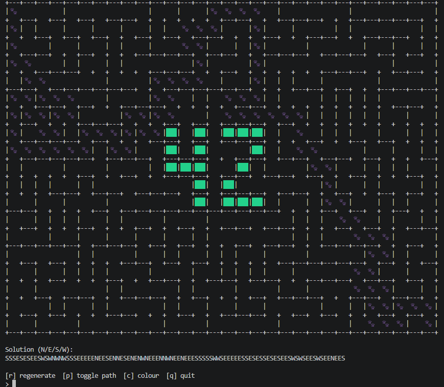

	<h1 >A_MAZE_ING (42 Cursus)</h1>
	
	
A sexy ass maze generator and solver

## Key Features

- **Iterative DFS maze generation** - Uses an iterative DFS algorithm (as opposed to recursive) for much more performant maze pathway generation.
- **Bitmask encoded** - Uses bitmasking to encode directional metadata (NSEW) into every cell for pathfinding and maze construction by performing cell-adjacent bitwise operations.
- **BFS pathfinding** - Implemented an elegant BFS pathfinding algorithm for O(V+E) unweighted graph traversal speed that radially enqueues cells in a FIFO order to guarantee shortest path.
	- Nodes are dequeued in the order they were discovered
	- Nodes discovered earlier = fewer steps from start
	- Longer paths that revisit nodes are blocked
	- i.e. The first time dequeueing the exit = shortest path locked
- **Dataclasses and types** - Intelligent and compact use of dataclasses and types such as Cell, Grid, etc to encode positional metadata into entities themselves— providing more flexible state management and avoiding excessive, arbitrary function parameters.